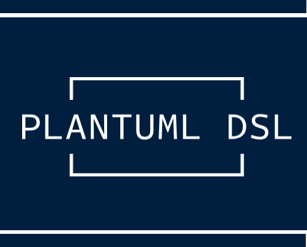

# PlantUML DSL


  

---

## Введение
PlantUML DSL - это декларативная надстройка поверх PlantUML, 
которая превращает создание диаграмм из рисования «одноразовых картинок» в модульное программирование.

Проблема: при обычном подходе каждый .puml-файл описывает одну конкретную диаграмму. 
Если в системе есть актор «Менеджер» и система «CRM», их нужно дублировать в Context, Container и Component диаграммах.

Решение: элементы регистрируются один раз как переиспользуемые модули, 
а затем подключаются к любым диаграммам без дублирования.   
Аналогия: элемент становится «функцией», которую вызывают в разных контекстах.

Начальная нотация - C4-модель (контекст, контейнеры, компоненты, развёртывание), 
с планами расширить на модели данных, поведенческие диаграммы и конечные автоматы.

## Основной алгоритм работы DSL
1. Регистрация элементов и отношений (описываем сущности один раз)
2. Включение элементов в диаграмму (выбираем, что показать)
3. Настройка выравнивания (управление расположением)
4. Настройка опций диаграммы (заголовок, легенда, стили)
5. Рендер (PlantUML генерирует изображение)

---

## Ключевые возможности
- **Декларативный API**: описываете **что** рисовать, а не **как**
- **Переиспользование**: регистрация элементов → подключение к разным диаграммам
- **Модульность**: C4, Data, Dynamic, Deployment, ...
- **Locator**: автоматическое вычисление путей к элементам по конвенции каталогов — не нужно повторять `Persons("Elements/...", User)` в каждой диаграмме
- **Встроенная трассировка и валидация**

---

## Сравнение с альтернативами
### PlantUML C4 (plantuml-stdlib/C4-PlantUML)
✅ Готовая библиотека для C4  
❌ Требует ручного управления стилями  
❌ Дублирование элементов между диаграммами

### Structurizr DSL
✅ Отличный DSL для архитектуры  
❌ Отдельный инструмент, не интегрирован с PlantUML  
❌ Требует отдельной инфраструктуры

### PlantUML DSL
✅ Работает поверх PlantUML (совместимость)  
✅ Переиспользование через регистрацию элементов  
✅ Модульность и расширяемость  
✅ Встроена трассировка и валидация  
⚠️ Ранняя стадия разработки

---

## Структура библиотеки

```
src/
├── Utils.puml          — общие утилиты ($format, $fail, $trace, ...)
├── Common.puml         — реестр элементов (дескрипторы, декораторы, очередь рендеринга)
├── Rendering.puml      — рендеринг диаграмм (Diagram, ApplyStyle, HideDescription, ...)
├── Locator.puml        — автоматическое вычисление путей к элементам
└── C4/
    └── Context.puml    — C4 Context диаграммы (Persons, Systems, Relations, Boundaries)
```

## Locator — автоматическое разрешение путей

Вместо того чтобы указывать путь к элементам в каждой диаграмме:

```plantuml
Persons("Elements/Persons", User Admin)
Systems("Elements/Systems", ERP DB)
Relations("Elements/Relations", User-ERP)
```

Locator позволяет задать конвенцию один раз (в `ENV.puml`) и использовать краткую форму:

```plantuml
!include ENV.puml
Persons(User Admin)
Systems(ERP DB)
Relations(User-ERP)
```

**Как это работает:**

1. Создайте `ENV.puml` с переменными окружения:
   ```plantuml
   %set_variable_value("LOCATOR_PERSONS_ROOT", "Elements/Persons")
   %set_variable_value("LOCATOR_SYSTEMS_ROOT", "Elements/Systems")
   %set_variable_value("LOCATOR_BOUNDARIES_ROOT", "Elements/Boundaries")
   %set_variable_value("LOCATOR_RELATIONS_ROOT", "Elements/Relations")
   ```

2. Разместите файлы элементов по конвенции:
   - `Elements/Persons/User.person.puml`
   - `Elements/Systems/ERP.system.puml`
   - `Elements/Relations/User-ERP.relation.puml`

3. Используйте 1-arg формы DSL-процедур — Locator сам найдёт файлы.

Пример: [`playground/LocatorDemo/`](./playground/LocatorDemo/)

---

## Roadmap
> TODO

---

## FAQ
По мере развития проекта здесь появятся ответы на частые вопросы.

---

## Contributing
Смотрите [CONTRIBUTING.md](./CONTRIBUTING.md) для подробностей.

**Важно:** перед коммитом запустите `task test` для проверки тестов.
